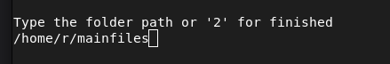
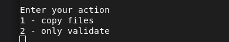
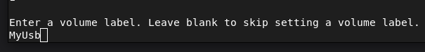
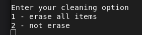
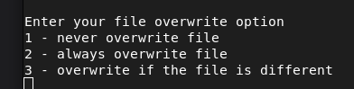
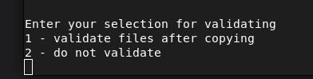
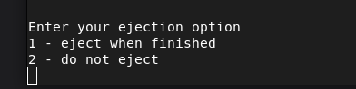

# Sd card writer/duplicator

This program will write the contents of whatever folders you input to as many SD cards or USB drives you want.
Run the executable and follow the instructions.
**Designed with performance in mind.**

###  Prerequisites:
This needs the dotnet 9 runtime version.

### The program:
Select folders you want to copy from. This will copy all the folders and files from the folder you select.

Select copy or validate only

Enter a volume label if desired

Select cleaning options

Select overwrite options if the file already exists on the destination

Select if you want to validate after copying or not. This will only validate that the files found in the input folder are the same on the destination drives. It will ignore all other files.

Select if you want to safely eject/unmount when finished

Confirm your choices and start the process!

### Linux
Install the prerequisites.
Download the release version.
Open from a terminal.

### Windows
Install the prerequisites.
Download the release version
Double click on the exe.

### Background
I duplicate a lot of sd cards. I originally started with images and Balena Etcher to write them to sd cards. But I had several issues.
One was that my power would often go out leaving me with restarting the whole process. The other was that many
of my images were the same except for a few files leading to lots of wasted space on my hard drive.

Out of this necessity I set out to create a program that would write the contents of different folders to multiple sd cards at the same
time and do it quickly. If the power went off and back on, then I could start where I left off. I could also 
just validate the sd cards that the copy was successful.

I started with Winforms but that was unusable on my Linux computer so I rewrote it as a console application
so it will run on both Windows and Linux.

I did achieve my performance goals. On my comptuter I can write to 16 16gb sd cards in 2/3 the time it took with 
Balena Etcher. It takes me about 30 minutes on my setup.
